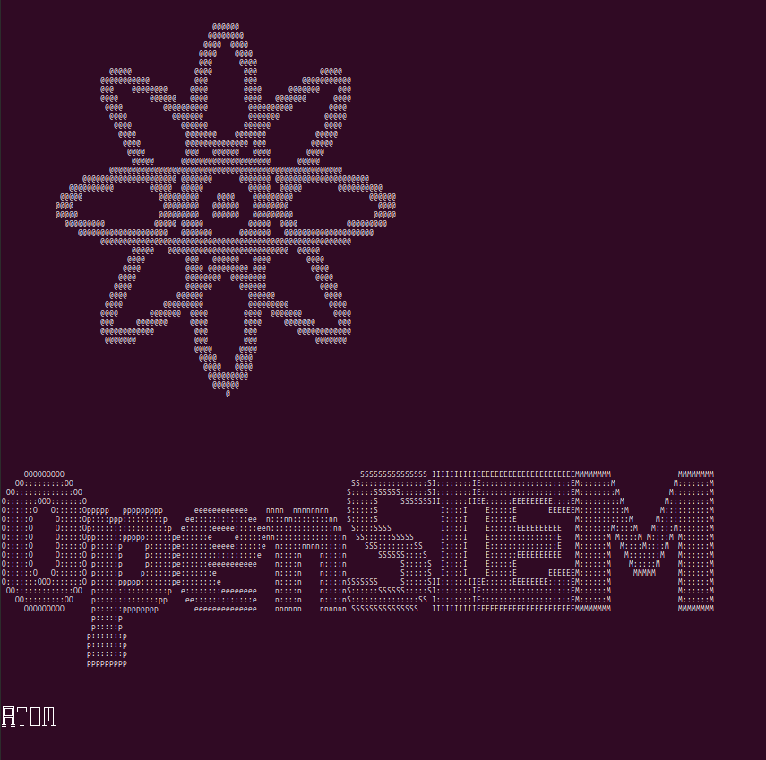
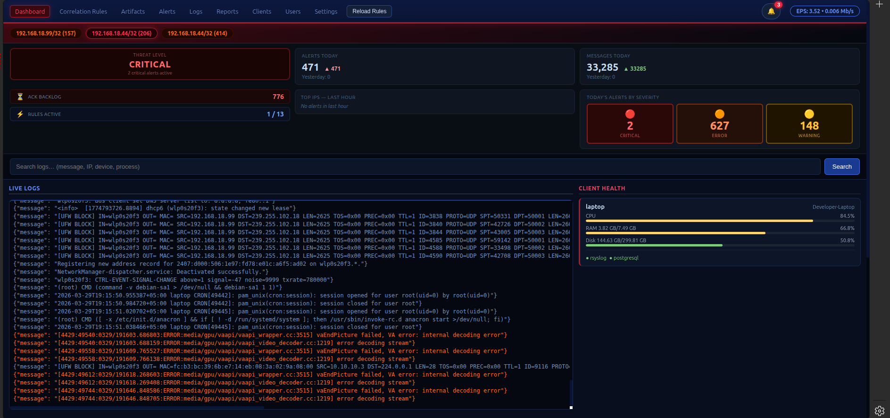
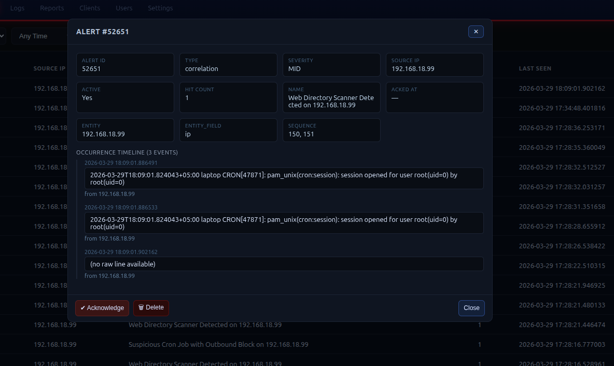
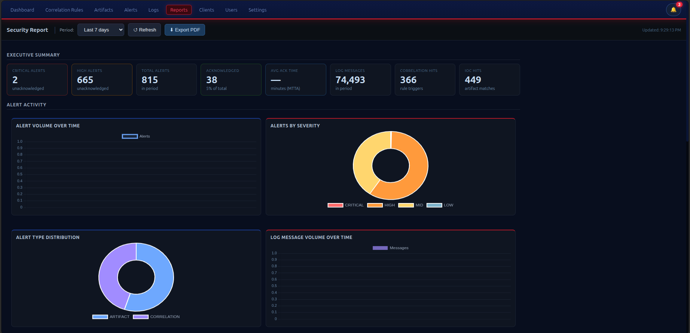
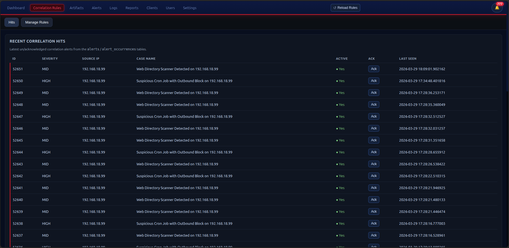
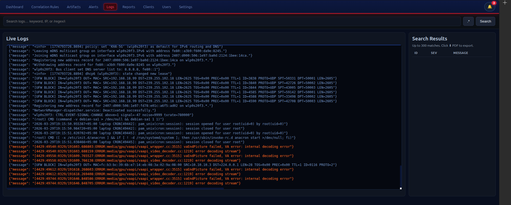

# OpenSIEM ⚛️
Security Information & Event Management Platform  
GPL‑3.0 Licensed — Open Source, Community Driven

---

## 📌 Overview
OpenSIEM is a modern, modular, open‑source SIEM designed for clarity, stability, and extensibility.  
It includes:

✅ Real‑time log collection  
✅ Correlation engine  
✅ Rule-based detection  
✅ Web UI for alerting  
✅ Modular Python architecture  
✅ PostgreSQL backend  
✅ Notification system  
✅ Watcher client for remote systems

OpenSIEM prioritizes **Ease**, **transparency**, **security**, and **community collaboration**.

---

## 🧑‍💻 Features
- Real‑time correlation engine  
- Multi-step rule evaluations  
- Web-based dashboard  
- Alert aggregation & notifications  
- Modular plugin architecture  
- Systemd-ready services  
- Python watcher agent for endpoints

---

## 📸 Snapshots

---
## 📦 Installation
See the **OpenSIEM Installation Manual (DOCX)** included in this release.

---

## 📝 License
OpenSIEM is licensed under **GNU GPL‑3.0**.

This means:
- ✅ The project remains open-source forever  
- ✅ Forks must also remain open-source  
- ✅ Modified versions must publish their modified source  
- ❌ No one may create closed-source versions of OpenSIEM  

For full license details, see `LICENSE`.

---

## 🤝 Contributing
I welcome contributions!  
See `CONTRIBUTING.md` for guidelines.

---

## 🔐 Security Reporting
Please DO NOT open public issues for vulnerabilities.  
See `SECURITY.md` for secure reporting instructions.

---

## 👤 Maintainer
**Waqar Afridi** (Project Creator & Lead Maintainer)  
See `MAINTAINERS.md` for details.

---

## ⭐ Support the Project
If you find OpenSIEM useful, please consider:
- ⭐ Starring the repository  
- 🛠 Submitting improvements  
- 🧪 Testing new releases  
- 📣 Sharing the project

Together we can build a powerful open‑source SIEM.
